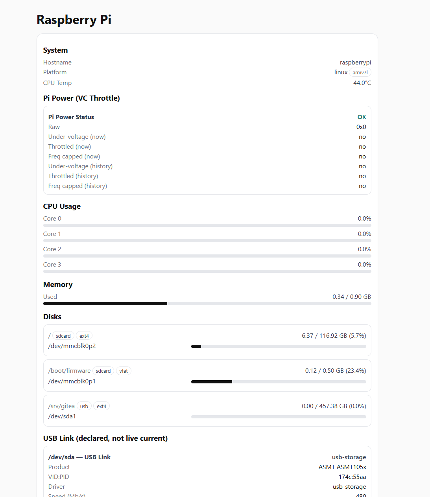

# RaspberryPi-Monitor
A lightweight web dashboard for monitoring Raspberry Pi system stats and attached USB disks



---

## Features

* **CPU**: per-core usage bars, CPU temperature
* **Memory**: usage with animated bar
* **Disks**: usage per partition (SD card + USB)
* **SMART**: health info for USB drives (model, serial, temp, power-on hours, CRC errors, etc.)
* **Power**:

  * Pi undervoltage / throttling flags via `vcgencmd`
  * USB link info: driver (`uas`/`usb-storage`), negotiated speed, declared MaxPower (descriptor only, *not* live current)

---

## Requirements

### Python deps

Install inside a virtualenv:

```bash
python3 -m venv .venv
source .venv/bin/activate
pip install fastapi uvicorn psutil
```

### System tools

```bash
sudo apt-get update
sudo apt-get install -y smartmontools
```

`vcgencmd` is preinstalled on Raspberry Pi OS.

---

## SMART Permissions

`smartctl` requires root for USB drives. Add a sudoers rule so your app user can run it without a password:

```bash
which smartctl   # /usr/sbin/smartctl
echo "$(whoami) ALL=(root) NOPASSWD:/usr/sbin/smartctl" | sudo tee /etc/sudoers.d/smartctl
sudo visudo -cf /etc/sudoers.d/smartctl   # 'parsed OK'
```

Restart the app as your **normal user** (not `sudo`).

---

## Project Layout

```
RaspberryPi-Monitor/
├── server.py
└── static/
    └── index.html
```

---

## How to Start the App

### Option 1: Manual run

From the project folder:

```bash
source .venv/bin/activate
uvicorn server:app --host 0.0.0.0 --port 8000 --workers 1
```

Open in browser:
`http://raspberrypi:8000`

---

### Option 2: Run as a systemd service

Create `/etc/systemd/system/pimonitor.service`:

```ini
[Unit]
Description=Raspberry Pi Monitor
After=network.target

[Service]
Type=simple
User=pi # username
WorkingDirectory=/home/pi/RaspberryPi-Monitor  # path to project folder
ExecStart=/home/pi/RaspberryPi-Monitor/.venv/bin/uvicorn server:app --host 0.0.0.0 --port 8000 --workers 1 # path to uvicorn inside your venv
Restart=on-failure
RestartSec=5

[Install]
WantedBy=multi-user.target
```

Enable + start:

```bash
sudo systemctl daemon-reload
sudo systemctl enable pimonitor
sudo systemctl start pimonitor
```

Check status/logs:

```bash
sudo systemctl status pimonitor
journalctl -u pimonitor -f
```

The app will now auto-start at boot.

---

## Notes

* **SMART CRC errors > 0** → usually bad cable or insufficient power. Use a powered USB hub or better PSU.
* **USB MaxPower** in the UI is from the device descriptor, **not real-time current draw**.
* **Pi undervoltage** warnings come from `vcgencmd get_throttled`. If you see "Under-voltage NOW", fix your power supply.

---

## Resources / Links

* **FastAPI docs:** https://fastapi.tiangolo.com/
* **Uvicorn docs:** https://uvicorn.dev/#running-programmatically
* **SMART FAQ:** https://www.smartmontools.org/wiki/FAQ
* **Parsing SMART output:** https://stackoverflow.com/questions/22049136/python-how-to-parse-smartctl-program-output

---

## License

MIT
